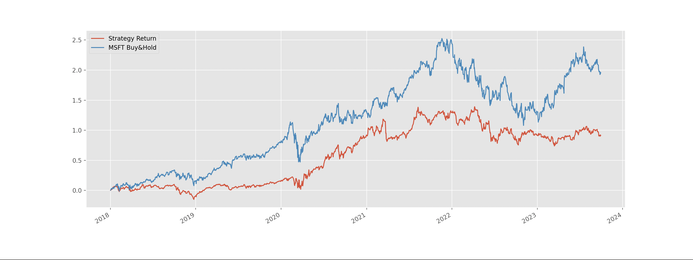
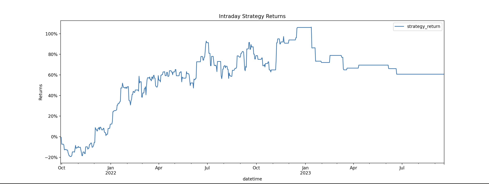
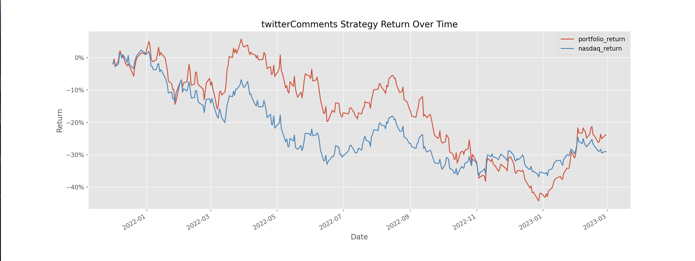
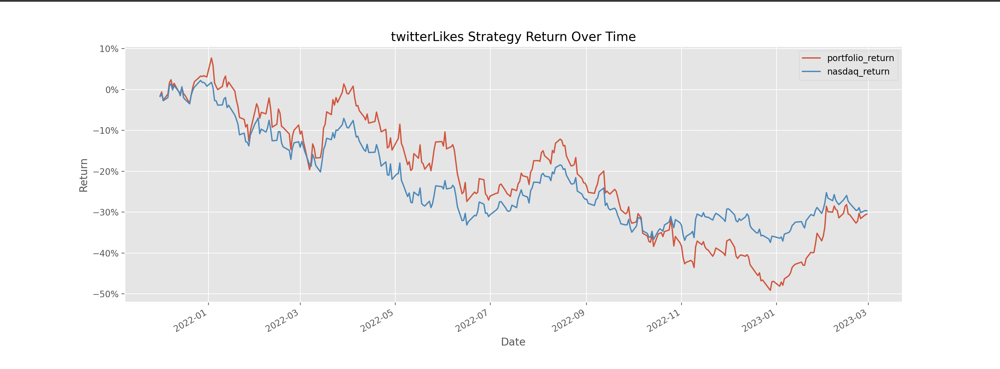
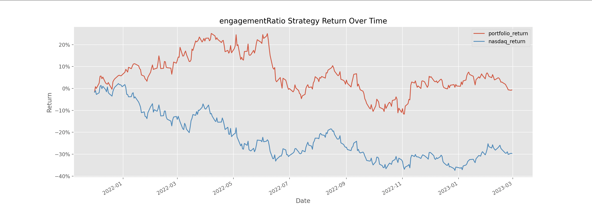
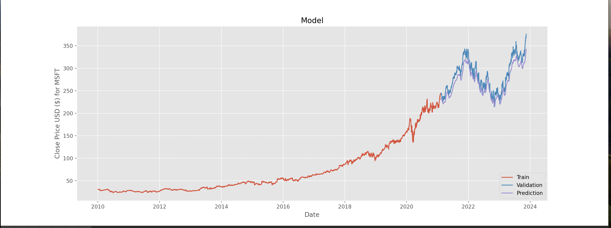

# Trading_With_Machine_Learning

This is a simple project I made just to experiment with different trading strategies and trying to utilize machine learning models to help predict data. Note: Please do not use this for actual stock advice.

Following are the differnt folders and the results from those folders:

## Unsupervised Learning

This folder contains the unsupervised learning logic using the KMeans function from sklearn, and applying it to the SP500 dataset with indicators such as RSI, garman-klass volatility etc (more indicators are in `indiactors.py`). The details can be be found mainly in `unsupervised.py` and the main indicators can be found in `indicators.py`. You can change which stock you want to see by changing the parameters of the `plot_strategy_returns` functions on line 30 in `main.py`. You can run the program by running main.py using the command.

```
    python main.py
```

when you are in the Unsupervised folder.

Sample result:


## Intraday strategy

This folder contains the intraday strategy logic where I try to find the optimum buy and hold strategies for a single day using RSI Momentum and other factors. You can run this file via

```
    python main.py
```

in the Intraday_Strategy folder. If you want to change the p and q models for the Arch Model, you can do so by changing the values in the `predict_volatilty` function call in line 19 in `intraday.py`

Sample result:


## Sentiment Analysis

This folder contains the sentiment analysis logic where I try to find which stocks are performing the best via Twitter engagement analysis. I use 3 forms of analysis to check which stocks are performing the best: twitterLikes, twitterComments or engagementRatio (you can change how you define this). You can change the one which you want to filter by in `main.py` by changing the value of factor.

Sample result (for twitterComments):


Sample result (for twitterLikes):


Sample result (for engagementRatio):


## LSTM

This folder contains all the logic for my LSTM (Long short term memory) model for predicting common stock prices. Right now, the model archiecture is defined in `lstm.py` and is pretty simple but there is going to be more complex additions in the future. You can adapt the model as you wish by making changes to `lstm.py`

Sample result:


## TODOS

- Add more complex architecture for LSTM
- Added more indiactors to LSTM for model to train on (similar to UnSupervised Learning)
